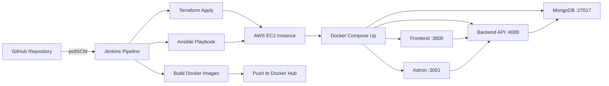

# RYNZA Dockerized MERN E-Commerce with CI/CD

Production-style MERN e-commerce platform with a customer frontend, admin panel, backend API, and MongoDB, fully containerized with Docker and automated through Jenkins, Terraform, and Ansible.

## What This Repository Contains

- Frontend app (React + Vite + Tailwind) for customers
- Admin panel (React + Vite + Tailwind) for product/order management
- Backend API (Node.js + Express + MongoDB + JWT + Cloudinary + Stripe)
- Dockerized local and production deployment definitions
- Jenkins pipeline for build, push, infra provisioning, and redeploy
- Terraform for AWS server provisioning
- Ansible for server configuration and deployment

## Repository Structure

```text
.
├── admin-panel/            # Admin UI
├── backend/                # Express API
├── frontend/               # Customer UI
├── terraform-deploy/       # AWS infrastructure provisioning
├── deploy.yml              # Ansible playbook
├── docker-compose.yml      # Local development stack
├── docker-compose.prod.yml # Production stack (Docker Hub images)
└── Jenkinsfile             # CI/CD pipeline
```

## Tech Stack

- Frontend: React, Vite, Tailwind CSS, Axios, React Router
- Backend: Node.js, Express, Mongoose, JWT, Multer, Cloudinary, Stripe
- Database: MongoDB 6
- Containers: Docker, Docker Compose
- CI/CD: Jenkins (pollSCM), Docker Hub
- IaC + Config: Terraform, Ansible
- Cloud: AWS EC2

## Architecture



## Service Ports

- Frontend: `3000`
- Admin panel: `3001`
- Backend API: `4000`
- MongoDB: `27017`

## Prerequisites

For local development:

- Docker and Docker Compose
- Node.js 18+ and npm (optional, only if running without Docker)

For full CI/CD automation:

- Jenkins with credentials configured
- Docker Hub account/repositories
- AWS credentials (for Terraform)
- Ansible available in Jenkins environment

## Quick Start (Docker - Local)

1. Clone repository and move into it.
2. Create a root `.env` file.
3. Start all services.

```bash
docker compose up --build -d
```

4. Open apps:

- Frontend: `http://localhost:3000`
- Admin panel: `http://localhost:3001`
- Backend health: `http://localhost:4000/`

5. Stop services:

```bash
docker compose down
```

## Run Without Docker (Optional)

Open 3 terminals:

```bash
# Terminal 1
cd backend
npm install
npm run server

# Terminal 2
cd frontend
npm install
npm run dev

# Terminal 3
cd admin-panel
npm install
npm run dev
```

Default backend URL for both frontend apps is:

```text
http://localhost:4000
```

You can override it using `VITE_BACKEND_URL`.

## Environment Variables

Create `.env` in repository root for Docker Compose and deployment.

Required variables:

```env
MONGODB_URL=
CLOUDINARY_API_KEY=
CLOUDINARY_SECRET_KEY=
CLOUDINARY_NAME=
JWT_SECRET=
ADMIN_EMAIL=
ADMIN_PASSWORD=
STRIPE_SECRET_KEY=
PORT=4000
NODE_ENV=production
```

## CI/CD Pipeline (Jenkins)

Pipeline file: `Jenkinsfile`

Current automated flow:

1. Checkout repository (`feature/full-automation` branch)
2. Provision/refresh infrastructure using Terraform
3. Read generated server public IP
4. Build backend, frontend, and admin Docker images
5. Push images to Docker Hub
6. Wait for server readiness
7. Configure and deploy on EC2 via Ansible + Docker Compose

SCM trigger mode:

- `pollSCM '* * * * *'` (checks for changes every minute)

## Production Deployment Flow

Production compose file uses prebuilt Docker Hub images:

- `inshafrajaaei/rynza-backend:latest`
- `inshafrajaaei/rynza-frontend:latest`
- `inshafrajaaei/rynza-admin:latest`

Ansible does:

- Install Docker + Docker Compose on server
- Copy `docker-compose.prod.yml` to server
- Create server `.env` with runtime secrets
- Pull latest images
- Restart containers

## Infrastructure (Terraform)

Location: `terraform-deploy/main.tf`

What it provisions:

- AWS EC2 instance (`t3.micro`)
- Security group allowing SSH (`22`) and app ports (`3000-5000`)
- SSH key pair and local private key file
- Output: server public IP (`server_ip`)

## API Base Endpoints

- `GET /` -> API working check
- `/api/user`
- `/api/product`
- `/api/cart`
- `/api/order`

## Troubleshooting

### `npm run dev` fails with command not found

Install dependencies first:

```bash
npm install
npm run dev
```

### Frontend cannot reach backend

- Verify backend is running on `:4000`
- Verify `VITE_BACKEND_URL` in build/runtime
- Verify Docker network and mapped ports

### Jenkins builds but deployment not updated

- Confirm Docker Hub push succeeded
- Confirm server `.env` is valid
- Check Ansible play output for pull/up failures
- Verify containers on server with `docker ps`

## Security Notes

- Do not commit `.env` or private keys
- Store secrets in Jenkins Credentials
- Restrict security group CIDRs in real production
- Avoid exposing database ports publicly unless required

## Future Improvements

- Add automated tests to pipeline stages
- Add image vulnerability scanning
- Add health checks and rollback strategy
- Add HTTPS + reverse proxy (Nginx/Traefik)

## Author

Built by Inshaf Rajaaei.

